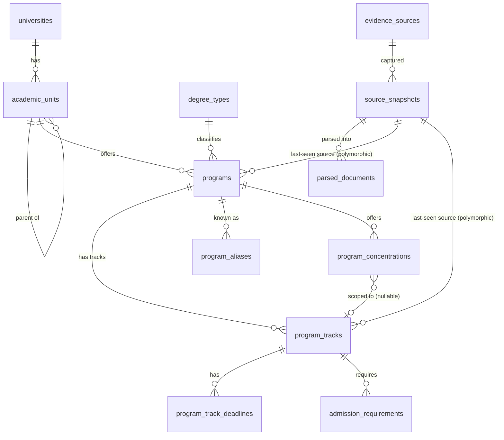

# Phase 2 Design: Program / Catalog Schema and Ingestion

**Status: design only. No implementation in this document or its
companion PR.** Per `FULL_HANDOFF.md` §21, this covers "program/catalog
schema" and "catalog adapter framework" as a design proposal, to be
reviewed before any scraping or migration work starts. Pilot institutions
are proposed at the end, not crawled.

**Review status (2026-07-20)**: Phase 2.1 (schema only — no adapters, no
crawling) is implemented and CI-green: `academic_units`, `degree_types`,
`programs`, `program_aliases`, `program_tracks`, `program_track_deadlines`,
`program_concentrations`, `admission_requirements`, `evidence_sources`,
`source_snapshots`. `parsed_documents`, `data_review_tasks`, and
`data_conflicts` remain Phase 2.2 scope — adapter-pipeline mechanics, not
core catalog structure, and not yet built. 3 of 4 open decisions in §14
were resolved before implementation (simplified provenance, track-level
admission requirements, no auto-promotion allowlist); PDF catalog handling
depth remains open pending real examples. A post-implementation schema
walkthrough then surfaced two semantic risks (SourceSnapshot deletion
semantics, Program/Track identity boundaries) — both are now resolved
in §5, §7.2, and §8 below. No schema, migration, or model code changed as
part of that resolution; this revision is documentation only.

## 0. Governing principle

> All raw information from a school's own site is preserved in full
> (original text and source URL). Standardized/normalized fields are
> nothing more than a structured reading of that raw information, and
> every field must be traceable back to where it came from.

This is stricter than "keep a URL somewhere." It means: for any field a
human or an LLM had to *interpret* (a deadline, a GPA minimum, a
prerequisite list, a funding note), the system stores the raw source text
next to the normalized value, not instead of it. Section 4 spells out
which fields get this treatment and why not all of them need to.

---

## 1. Scope of this phase

In scope: program discovery and canonicalization, degree/track/concentration
structure, admission-requirement text and light structuring, provenance
infrastructure, catalog adapters, a human review queue, duplicate
detection. Out of scope (later phases per the roadmap): funding data,
historical admission/funding outcomes, recommendation logic, image/screenshot
parsing.

---

## 2. Entity model



(`source_snapshots`' links to content tables are entity-level provenance —
every content row's `last_seen_snapshot_id` — not a separate per-field
ledger. See §5 for why: a full field-level `field_provenance` table was
considered and deliberately deferred in favor of this simpler model.)

### 2.1 Core hierarchy

```
academic_units
  id                    PK
  unitid                FK -> universities.unitid
  parent_unit_id        FK -> academic_units.id, nullable (self-referencing)
  unit_type             enum: college, school, department, division, institute, other
  name                  text                 -- as the institution names it
  official_url          text, nullable
  status                enum: active, paused, discontinued, unverified
  <provenance columns — see §5>
```

Self-referencing rather than a fixed "college > department" two-level
model, because real org structures vary (some schools go Graduate School
→ College → Department → Program; others are flat). `unit_type` +
`parent_unit_id` can represent either without a schema change.

```
degree_types                              -- controlled but extensible lookup
  code            PK, e.g. "MS", "MA", "MEng", "MFA", "MPH", "MSW", "PhD"
  label           e.g. "Master of Science"
  level           enum: masters, doctoral, certificate, other
```

A lookup table, not an enum, because real degree-name vocabulary is wide
and grows over time (new professional master's names appear regularly);
adding a row shouldn't require a migration. `programs` still separately
stores the school's own raw string — see §4.

```
programs
  id                     PK (this is the stable "program_id" FULL_HANDOFF.md §5 asks for)
  academic_unit_id       FK -> academic_units.id
  degree_type_code       FK -> degree_types.code
  raw_degree_name        text        -- exactly as the school writes it, e.g. "M.S."
  canonical_name         text        -- e.g. "Computer Science"
  cip_code               text, nullable
  program_url            text, nullable
  stem_designated        bool, nullable
  status                 enum: active, paused, discontinued, unverified
  <provenance columns>
  UNIQUE(academic_unit_id, degree_type_code, canonical_name) -- see §11

program_aliases                       -- same shape as university_aliases
  id, program_id (FK), alias, alias_type, source
  -- no provenance columns: an alias IS the raw form, nothing to interpret

program_tracks                        -- "the smallest meaningful unit" per §5
  id                     PK
  program_id             FK -> programs.id
  track_name             text                    -- raw, e.g. "Thesis Option"
  track_type             enum: thesis, non_thesis, project, coursework, unspecified
  modality               enum: in_person, online, hybrid, unspecified
  campus_name            text, nullable          -- see §7.1
  credits_required        int, nullable
  expected_duration_months int, nullable
  min_gpa                 numeric, nullable        -- normalized to a 0–4 scale; see §4
  min_gpa_raw              text, nullable           -- e.g. "3.0/4.0" or "75/100" as written
  toefl_min, ielts_min     int, nullable
  gre_policy               enum: required, optional, waived, not_accepted, unspecified
  cohort_size              int, nullable
  international_share      numeric, nullable
  status                   enum: active, paused, discontinued, unverified
  <provenance columns>

program_track_deadlines               -- one track can have several intake terms
  id, program_track_id (FK)
  intake_term            text          -- "Fall 2027", "Spring 2027"
  application_deadline    date, nullable
  priority_funding_deadline date, nullable
  is_rolling              bool
  deadline_raw_text        text         -- "Priority: Dec 15; final: Feb 1, domestic only"
  <provenance columns>
  UNIQUE(program_track_id, intake_term)

program_concentrations
  id, program_id (FK), program_track_id (FK, nullable)
  name                  text
  description_raw       text
  <provenance columns>

admission_requirements
  id, program_track_id (FK, NOT NULL — see §7.4 for why track-level, not program-level)
  requirement_type       enum: gpa, test_score, prerequisite_course, recommendation_letters, document, other
  structured_value        jsonb, nullable    -- e.g. {"min": 3.0, "scale": 4.0}
  raw_text                 text              -- always present
  <provenance columns>
```

`<provenance columns>` means `last_seen_snapshot_id` (FK →
`source_snapshots`, nullable, `ON DELETE SET NULL` — see §5 for why that's
an exceptional-cleanup path, not a normal one), `verification_status`, and
`last_verified_at`. **Exactly six tables carry these columns**:
`academic_units`, `programs`, `program_tracks`, `program_track_deadlines`,
`program_concentrations`, `admission_requirements`. Two tables
deliberately do *not*: `program_aliases` (an alias is raw text with
nothing to verify — a `created_at` timestamp is enough) and
`evidence_sources`/`source_snapshots` themselves (they *are* the evidence,
not a fact being verified against evidence — see §5).

`verification_status` reuses `FULL_HANDOFF.md` §15's case-state
vocabulary: `raw`, `parsed`, `needs_review`, `user_confirmed`,
`document_verified`, `rejected_as_invalid`. Two of these are easy to
conflate and shouldn't be:

- **`raw`** — the row was just ingested and has not been validated by
  anything yet. **This is the default for every new row.**
- **`needs_review`** — the pipeline actively detected a specific reason to
  flag it: ambiguity, low extraction confidence, a conflict with an
  existing value, or an LLM-fallback extraction (§10). A row does **not**
  move to `needs_review` just because it's new — that would make the
  status meaningless as a review-priority signal. New rows sit at `raw`
  until something concrete promotes or flags them.

This is the *entity-level* provenance; field-level detail (the specific
fields that need a raw-text sibling column rather than just row-level
tracking) is covered in §4 and §5.

---

## 3. Relationships, in one sentence each

- One **university** has many **academic_units**, which can nest (college
  → department → …).
- One **academic_unit** offers many **programs**; a **program** belongs to
  exactly one unit and one **degree_type** — together with `canonical_name`,
  these three form the program's identity (§11).
- One **program** has one or more **program_tracks** — this is where
  thesis/non-thesis, modality, and campus variation normally live (§7;
  §8 covers the narrow exception where a delivery variant needs to be a
  separate **program** instead).
- One **program_track** has zero or more **program_track_deadlines** (one
  per intake term) and one or more **admission_requirements** rows.
- **program_concentrations** hang off a **program**, optionally scoped to
  one **track** if a school ties a concentration to a specific modality or
  admission path.
- Every content-bearing row links back to a **source_snapshot** at the row
  level via `last_seen_snapshot_id`; the specific fields that were
  genuinely *interpreted* (not just copied) additionally carry a plain
  `raw_*` sibling column on the same row (§4, §5) — there is no separate
  field-level provenance table.

---

## 4. What gets standardized vs what stays raw

| Category | Standardize? | Raw text kept? |
|---|---|---|
| Program/track/unit names | Store both: `canonical_name` (cleaned for search/display) and the literal school string | Yes, always (the literal string *is* the raw form here — no separate raw column needed) |
| Degree type | `degree_type_code` (controlled lookup) | Yes — `raw_degree_name` |
| CIP code | Standardized (federal taxonomy) | Traceable via the row's `last_seen_snapshot_id` back to the catalog text it was inferred from, if not explicitly labeled by the school |
| Deadlines | Parsed to `date` where unambiguous | Yes, always — `deadline_raw_text`. Ambiguous cases (e.g. "rolling until filled," "priority Dec 1, otherwise space-available") are marked `is_rolling` / left null with the raw text as the source of truth, never guessed into a fake date |
| GPA / test-score minimums | Parsed to numeric, normalized to a stated scale | Yes, always — grading scales vary (0–4, 0–100, letter) and normalizing without keeping the original invites exactly the kind of silent error `FULL_HANDOFF.md` §9 warns about for GPA conversion |
| Prerequisites, recommendation requirements, general admission narrative | Light structuring only (`requirement_type` tag) | Yes, always — this text is usually too school-specific to fully normalize, and forcing it into structured fields would lose information |
| Program URL, official pages | n/a | The URL itself is the artifact; snapshot stores the fetched content |

Rule of thumb: **if going from raw text to a structured value required a
judgment call — by a human or an LLM — the raw text is mandatory, not
optional.** If the structured value *is* the raw value (e.g. a URL, or a
program name copied verbatim), a second raw copy would be redundant and
isn't required.

**If structured parsing fails or is uncertain, the raw value is never
discarded.** A field that can't be confidently normalized keeps its
`raw_*`/`raw_text` populated with the sibling structured column left
`null` (or `structured_value` left absent for admission requirements) —
"we couldn't parse this" is recorded as an absence of the normalized
value plus a present raw value, never as a silently dropped fact.

---

## 5. Provenance infrastructure

```
evidence_sources                      -- Phase 2.1, built
  id, unitid (FK, nullable — some sources aren't institution-specific, e.g. a ranking publisher)
  source_type     enum: academic_catalog, department_page, graduate_school_page,
                        international_office, institutional_report, ranking_publisher
  base_url
  UNIQUE(unitid, base_url)

source_snapshots                      -- Phase 2.1, built
  id, evidence_source_id (FK)
  url
  retrieved_at
  http_status
  content_hash          -- for cheap change detection (§6)
  raw_content            -- full fetched HTML/text/PDF-extracted-text
  fetch_method            -- which adapter fetched it

parsed_documents                      -- Phase 2.2, not yet built
  id, source_snapshot_id (FK)
  adapter_name, adapter_version
  parsed_at
  extraction_confidence
  raw_extraction         jsonb    -- the adapter's structured output, pre-review

data_review_tasks                     -- Phase 2.2, not yet built
  id, entity_type, entity_id, field_name (nullable — can flag a whole row)
  reason                  enum: low_confidence, first_seen, conflicts_with_existing,
                                adapter_fallback_used, possible_duplicate, reported_by_user
  status                   enum: open, in_review, resolved, dismissed
  assigned_to, resolved_at

data_conflicts                        -- Phase 2.2, not yet built
  id, entity_type, entity_id, field_name
  current_value, current_verification_status
  proposed_value, proposed_source_snapshot_id
  status                  enum: open, resolved_kept_current, resolved_took_proposed
```

**Decided (2026-07-20): no separate `field_provenance` EAV table for now.**
Provenance is tracked at two levels instead:

1. **Entity level** — every content table's `<provenance columns>` (§2)
   tie the whole row to `last_seen_snapshot_id` + `verification_status` +
   `last_verified_at`. If any part of a row needs review, the row is
   flagged, not an individual field.
2. **Field level, but only for the specific fields that need it** — plain
   sibling columns directly on the table, already sketched in §2:
   `programs.raw_degree_name`, `program_tracks.min_gpa_raw`,
   `program_track_deadlines.deadline_raw_text`,
   `admission_requirements.raw_text`. No independent confidence/
   verification-status per field — that metadata lives at the row level.

The accepted tradeoff: if a track's GPA minimum needs re-review but its
deadline doesn't, the whole track row shows as `needs_review`, not just
the GPA. That's coarser than full field-level provenance, but avoids the
EAV table's query complexity and a second join for every field read.
`data_review_tasks`/`data_conflicts` still record `field_name` when
useful (a reviewer should still see *which* field triggered a task), that
metadata just isn't backed by a standing per-field ledger table. Revisit
introducing `field_provenance` post-pilot if row-level granularity proves
too coarse in practice — e.g. if the same row keeps bouncing in and out of
review for unrelated fields.

### 5.1 SourceSnapshot lifecycle (decided 2026-07-20)

`source_snapshots` is **immutable and append-only in normal application
logic.** Refreshing data must:

1. insert a **new** `source_snapshots` row for the re-fetched page;
2. update the relevant content entities' `last_seen_snapshot_id` to point
   at the new row;
3. leave every prior `source_snapshots` row completely unchanged.

There is no "supersede" flag or update path on the row itself — whether a
snapshot is still the current evidence for something is entirely
determined by whether any content row's `last_seen_snapshot_id` still
points at it. Older snapshots simply stop being pointed at; they are not
edited, marked, or removed. This is what makes `source_snapshots` a real
audit trail rather than a cache: the full history of what a page said, and
when, stays queryable forever.

**Normal ingestion code must never delete a `source_snapshots` row.** The
`ON DELETE SET NULL` behavior on every content table's
`last_seen_snapshot_id` FK (confirmed empirically against the real schema:
it's the only `SET NULL` in the entire catalog schema, everything else is
`NO ACTION`) exists purely as **exceptional cleanup tolerance**, not as a
sanctioned product operation. Its only legitimate callers are:

- test/fixture cleanup (our own test suite truncates tables between runs);
- privacy/compliance-driven deletion (e.g. a legal takedown request);
- explicit, deliberate administrator maintenance.

If a snapshot referenced by `last_seen_snapshot_id` is ever deleted through
one of those paths, the reference cleanly nulls out rather than blocking
the deletion or cascading it into deleting the content row — that's the
entire purpose of `SET NULL` here. It is not permission for adapter or
ingestion code to delete snapshots as part of a normal re-crawl; re-crawls
only ever insert. No FK behavior changes as part of this clarification —
this is a documented operational rule, not a schema change. (If, once
Phase 2.2's refresh workflow exists, it turns out `SET NULL` is never
actually exercised outside of tests, tightening to `RESTRICT` is a small,
low-risk future migration — deferred rather than decided now, same as any
other change made only once real usage clarifies it's warranted.)

---

## 6. Data update strategy

1. **Re-crawl cadence**: periodic re-fetch per source (e.g. quarterly for
   `active`/verified programs, more frequently as application deadlines
   approach for tracked programs). Compare `content_hash` against the
   previous snapshot for the same URL — if unchanged, skip re-parsing
   entirely (cheap).
2. **Change detection**: if the hash differs, queue a re-parse
   (`parsed_documents`) — per §5.1, this always means *inserting* a new
   `source_snapshots` row, never touching the old one. If the newly parsed
   value differs from the currently stored value:
   - If the current value's `verification_status` is `document_verified`
     or `user_confirmed`, do **not** silently overwrite it — write a
     `data_conflicts` row and raise a `data_review_task`. This mirrors the
     non-regression rule already implemented in the HD importer (a newer
     IPEDS year can't silently overwrite a more-recent one; the same
     logic applies here to trust level rather than recency).
   - If the current value is only `parsed`/`raw`/`needs_review`, the new
     extraction can replace it automatically (nothing trusted is being
     clobbered).
3. **Status lifecycle**: if a program's page 404s or disappears from a
   catalog listing, don't immediately mark it `discontinued` — transient
   site issues happen. Mark `unverified` after one failed re-check,
   `discontinued` only after N consecutive failures (N TBD during pilot,
   probably 2–3 cycles), and always surface the transition as a
   `data_review_task` rather than a silent auto-update. Discontinuing a
   program is a `status` change, never a physical deletion — see §12.

---

## 7. Handling variants

### 7.1 Multiple campuses
IPEDS already assigns separate `UNITID`s to most distinguishable branch
campuses, so this is usually handled for free by the existing
`universities` table. For the residual case where one `UNITID` genuinely
offers a program at more than one physical site, `program_tracks.campus_name`
is a nullable field rather than a new top-level entity — avoids
speculative modeling until the pilot shows it's actually needed.

### 7.2 Modality (in-person / online / hybrid)

**Default rule**: modality is modeled on `program_tracks`, not `programs`
— because modality often comes with genuinely different admission
requirements and deadlines (a common real pattern: "MS CS – Online" has
different test-score policy than the on-campus version). Treating it as a
track dimension means it falls out of the existing `program_tracks` →
`admission_requirements` / `program_track_deadlines` structure with no
special-casing. The same reasoning covers campus (§7.1) and, conceptually,
residency format (full-residency vs. low-residency program structure) —
none of these are part of what makes two programs *different programs*;
they're variations in how the same program is delivered.

**Exception (decided 2026-07-20): an online or campus offering may need to
be modeled as a separate `programs` row instead of a track**, when the
institution officially treats it as a materially independent offering
rather than a delivery variant of the same program. This is a judgment
call, not a mechanical rule, but the following are the indicators an
adapter (or a human reviewer) should weigh:

- a separate admissions process (different application, different
  committee, different decision timeline);
- a separate tuition model (not just "online is cheaper" as a line-item
  discount, but a genuinely distinct cost structure/billing);
- a separate cohort (students don't mix with the on-campus cohort at all);
- separate administrative classification (the institution itself lists it
  as a distinctly-named, separately-administered program, not a track of
  another);
- a separate program website/marketing presence, operated independently;
- materially different visa eligibility (§8 — this is one of the
  strongest signals, since it reflects a real structural difference
  recognized by the institution's own international office, not just a
  labeling choice);
- materially different transfer/mobility rules;
- **no ability for a student to move between the online and campus
  versions** — if transferring from one to the other is essentially
  re-admission to a different program, that's strong evidence they *are*
  different programs;
- a degree structure that is separately marketed and operated end to end
  (e.g. Georgia Tech's OMSCS is commonly discussed as operating this way
  relative to its on-campus MSCS — see §8 for why this project doesn't
  assert that as a confirmed fact without an official source, but it's
  exactly the shape of case this indicator list is meant to catch).

**When this is ambiguous, the adapter must create a `data_review_task`
rather than automatically merging the offering as a track of an existing
program**, and must not automatically split it into a new program either.
Defaulting to "it's a track" when the indicators actually point the other
way would misrepresent a structurally distinct program as a minor variant
— which is exactly the kind of false precision this project's mandatory
rules (`FULL_HANDOFF.md` §23) warn against. Silently guessing in either
direction is worse than asking a human.

### 7.3 Multiple intake terms / deadlines
Handled by `program_track_deadlines` being a child table (one row per
intake term) rather than flattening `fall_deadline`/`spring_deadline`
columns onto `program_tracks` — supports however many terms a school
actually offers without a schema change.

### 7.4 Different degree types under "the same" program
E.g. a department offering both an MS and a PhD in Computer Science. These
are two separate `programs` rows (different `degree_type_code`), sharing
the same `academic_unit_id`. This isn't special-cased — it falls directly
out of the identity key `FULL_HANDOFF.md` §5 already specifies: *university
+ college + department + degree + program + track*. Degree type is part of
what makes two programs different, not a variant of one program. MS and
PhD are never modeled as two tracks of one program, precisely because
`degree_type_code` is part of `programs`' identity (§11), not
`program_tracks`' — `program_tracks` has no degree-related column at all,
so a track always inherits its degree unambiguously from its parent
`programs` row via `program_id`. There is no path for a track to disagree
with its program about what degree it leads to.

This is also why `admission_requirements` links to `program_track_id`
rather than `program_id`: requirements are frequently degree- and
track-specific (an MS and a PhD in the same department rarely share
identical admission criteria), so anchoring at the track level is more
correct even though it means near-duplicate requirement rows for programs
whose tracks genuinely do share identical requirements.

**Decided (2026-07-20): track level, accepting the duplication.** The
alternative (requirements at the program level with per-track overrides)
adds resolution-order complexity (`COALESCE(track_value, program_value)`
at every read) for a case that may not be common enough to justify it —
and it cuts against keeping Phase 2 simple and controllable for the pilot,
which was an explicit priority. Revisit after the pilot shows how often
tracks actually share requirements verbatim.

### 7.5 Concentrations
`program_concentrations` references `program_id` (concentrations are
usually presented as a menu within one program) with an optional
`program_track_id` for the less common case where a school ties
concentration availability to a specific track/modality.

---

## 8. Credential legitimacy, delivery modality, and visa eligibility are separate concepts

These three axes are easy to conflate and must not be:

1. **Credential legitimacy** — is this an official, credit-bearing degree
   at all, or a certificate/non-credit/executive-education offering?
2. **Delivery modality** — online, hybrid, or in-person (§7.2).
3. **Immigration/visa eligibility** — can this specific offering support an
   F-1 student's I-20 and, downstream, OPT?

**A fully online program can be an official, credit-bearing master's
degree while still being structurally unable to issue an I-20 or support
F-1/OPT status.** Being a real degree and being visa-eligible are
independent facts. Conflating them — e.g. inferring "it's a real master's,
therefore it must support a visa" or the reverse — would be exactly the
kind of invented precision `FULL_HANDOFF.md` §23 prohibits.

**University-level I-20 capability must never be used as a proxy for
program- or track-level eligibility.** A university that can issue I-20s
for its on-campus programs does not imply every program at that
university can — a fully online program at an I-20-capable university is
a common real pattern where the university-level fact is true and the
program-level fact is false. The reverse error (assuming a program can't
be visa-eligible just because it's associated with a "mostly online"
university) is equally a fabrication if asserted without a program-level
source.

### 8.1 Design concepts (not schema yet)

These are concepts to design around, not columns to add now — no schema
or migration changes are part of this document:

```
credential_status (design concept, not yet a column/enum):
  DEGREE
  CERTIFICATE
  NON_CREDIT_CERTIFICATE
  EXECUTIVE_EDUCATION
  MICROCREDENTIAL
  UNKNOWN

visa_support_status (design concept, not yet a column/enum):
  I20_ELIGIBLE
  NO_I20_ONLINE_ONLY
  NO_I20_NON_DEGREE
  I20_DEPENDS_ON_CAMPUS_OR_TRACK
  I20_ELIGIBILITY_UNCLEAR
  NOT_APPLICABLE
```

When these are eventually implemented, visa eligibility must be modeled at
the **narrowest applicable scope: program, with an optional track-level
override** — never as a single university-level boolean, for the reason
stated above. A university may have some visa-eligible and some
visa-ineligible programs simultaneously; a program may even have some
visa-eligible and some visa-ineligible tracks (e.g. an on-campus track
that supports F-1 and an online track of the "same" program that
doesn't — which, per §7.2, is itself one of the strongest signals that
they might actually need to be modeled as separate programs rather than
tracks of one).

Visa-related facts are exactly the kind of high-stakes, easily-stale claim
that needs the strongest provenance discipline in this whole schema:
**official source and last-verification date must be retained for every
visa-related fact**, no exceptions — this is the general provenance
principle (§0, §5) applied to the field type where getting it wrong causes
the most real-world harm to an applicant.

### 8.2 User-facing distinction (future requirement)

Once implemented, program pages and search results must clearly and
separately answer, for each program/track:

- Is this an official degree?
- Is it fully online?
- Can it issue an I-20?
- Does it support physically studying in the United States?
- Might it support F-1/OPT?
- Is it suitable only for remote study?

Two sentences worth encoding directly into that future user-facing design,
because they're the two most common wrong assumptions:

> An official U.S. master's degree is not automatically an I-20-eligible
> program.
>
> A university that can issue I-20s does not imply that every program at
> that university can issue an I-20.

### 8.3 Future test fixtures (names only — no claims asserted here)

The following are recorded as candidate institution/program names for
future adapter and classification test fixtures, **not** as factual
claims about their actual credential, modality, or visa status. Nothing
about these four is asserted in this document; any real classification
must come from an official source with provenance, per §0/§8.1, when that
work actually happens:

- UT Austin CDSO MSCS
- UT Austin CDSO MSDS
- UT Austin CDSO MSAI
- Georgia Tech OMSCS

These names are useful specifically *because* they're publicly associated
with exactly the online/visa ambiguity this section exists to handle
correctly — that's why they're worth having as test fixtures later, not
because this document knows or asserts anything definitive about them.

---

## 9. Catalog adapter architecture

Interface, expanding `FULL_HANDOFF.md` §5's sketch:

```python
class CatalogAdapter(Protocol):
    def detect(self, url: str, html: str) -> bool:
        """Cheap, order-sensitive check: does this adapter recognize the page?"""

    def extract_programs(self, html: str) -> list[RawProgramCandidate]: ...
    def extract_degrees(self, html: str) -> list[RawDegreeCandidate]: ...
    def extract_requirements(self, html: str) -> list[RawRequirementCandidate]: ...
```

Concrete adapters, tried in order via a registry (first `detect()` match
wins): `AcalogAdapter`, `CourseLeafAdapter`, `ModernCampusAdapter`,
`PdfCatalogAdapter`, `GenericHtmlAdapter`, `LLMFallbackAdapter` (always
matches — the catch-all).

Pipeline:

```
fetch page
  → write source_snapshot (raw content + content_hash) — insert-only, §5.1
  → adapter registry .detect() in priority order
  → deterministic parse (adapter-specific) → RawProgramCandidate / etc.
  → validation (schema shape, sanity bounds — "GPA must be 0–4 or 0–100",
    "deadline must be a plausible date", "credits > 0")
  → if parse failed or confidence is low: LLMFallbackAdapter on cleaned text
  → write parsed_documents (raw_extraction, confidence)
  → write/update programs/tracks/etc. at verification_status = "parsed"
    (deterministic adapters) or "needs_review" (LLM fallback, always)
  → data_review_task created for anything below a confidence threshold,
    produced by the LLM fallback, or ambiguous per §7.2/§10 (possible new
    program vs. track, possible duplicate)
```

Detection is by URL pattern first (e.g. `*.courseleaf.com`,
`/acalog/` path segments — cheap, no page fetch needed to guess) and HTML
fingerprint second (recognizable markup/meta tags each platform emits) —
this needs to be verified against real examples in the pilot, not assumed;
adapter detection heuristics are exactly the kind of thing that looks
right in isolation and breaks on a real page.

**Cost control**: the LLM fallback is the expensive path and should be the
minority case if deterministic adapters are doing their job — this is
worth tracking as a metric (`% of pages parsed by LLMFallbackAdapter`)
from the very first pilot run, not added later.

---

## 10. Human review mechanism

- Every automated write defaults to `verification_status = parsed` (deterministic
  adapter) or `needs_review` (LLM fallback) — never `document_verified`.
  Nothing is presented to end users as fully trusted until a human confirms
  it.
- `data_review_tasks` is the queue. A reviewer sees: the raw text, the
  proposed normalized value, the source URL/snapshot, and (for conflicts)
  the currently stored value side by side.
- Reviewer actions: **confirm** (→ `user_confirmed`), **edit** (correct the
  normalized value; raw text is never edited, only annotated as
  superseded), **reject** (→ `rejected_as_invalid`, field reverts to null
  pending re-extraction).
- **Decided (2026-07-20): no auto-promotion allowlist, for any adapter, for
  now.** Every automated extraction — deterministic adapter or LLM
  fallback alike — goes through `data_review_tasks` before it can reach
  `user_confirmed`/`document_verified`. The rationale: this project's core
  credibility promise depends on the data being trustworthy, and there's
  no pilot evidence yet about which adapters/fields are actually reliable
  enough to skip review safely — deciding an allowlist now would be
  guessing. Revisit once the pilot produces real confidence-calibration
  data (e.g. "CourseLeaf program names were correct in 200/200 manual
  spot-checks").
- This mirrors `FULL_HANDOFF.md` §15's evidence levels and §17's
  requirement to show "evidence confidence" separately from "model
  confidence" on the eventual recommendation card — the schema here is
  what makes that distinction possible downstream.

---

## 11. Program uniqueness and duplicate detection

`programs` carries `UNIQUE(academic_unit_id, degree_type_code,
canonical_name)` (`uq_program_identity`) at the database level. It's
important to be precise about what this constraint is and isn't:

**It is a collision detector — an exact-match backstop against literal
re-insertion of the same identity tuple** (e.g. an adapter re-running
without proper idempotency, or two sources describing the same program
with identical normalized text). **It is not, and was never meant to be, a
replacement for**:

- canonicalization (deciding that "M.S. Computer Science" and "MS in
  Computer Science" are the same program);
- alias resolution (recognizing "MSCS" refers to an existing program);
- source reconciliation (merging what two different catalog pages say
  about what the institution considers one program);
- human review of ambiguous cases.

Those four are fuzzy-matching and judgment problems that a hard uniqueness
constraint structurally cannot solve — near-duplicates by definition don't
collide on an exact-match key. They belong to Phase 2.2's adapter/dedup
logic, not to the Phase 2.1 schema:

1. **Before creating a new `programs` row**, normalize the candidate name
   (case, whitespace, punctuation) and check `program_aliases` +
   `programs.canonical_name` for a close match within the same
   `academic_unit_id` + `degree_type_code`. Use Postgres `pg_trgm` trigram
   similarity for fuzzy matching.
2. **CIP code as a secondary signal**: matching CIP code + unit + degree
   type is strong duplicate evidence even when the name text differs more
   than the trigram threshold catches.
3. **Never auto-merge, and never silently insert a second near-duplicate
   row.** A likely-duplicate match — whether caught by fuzzy matching
   *or* by an actual `uq_program_identity` constraint violation at
   insert time — must create a `data_review_task` (`reason =
   possible_duplicate`) with both candidates shown side by side, same
   "system suggests, human confirms" pattern `FULL_HANDOFF.md` §14
   specifies for community-data case bundles. A raw constraint violation
   bubbling up as an unhandled database error is not acceptable adapter
   behavior — it must be caught and turned into a review task.
4. Once merged, the losing name becomes a `program_aliases` row rather
   than being discarded — so future re-crawls that surface the same
   variant text match on the first pass instead of re-triggering a
   duplicate review.

(§7.2 and §8 cover the related-but-distinct question of when two
offerings that *aren't* name-duplicates should nonetheless be one program
with multiple tracks versus two genuinely separate programs — that's a
modeling decision, whereas this section is about not creating accidental
duplicate rows of what's already agreed to be the same program.)

---

## 12. Deletion behavior

Confirmed empirically against the real Phase 2.1 schema: parent-child
delete cascades (e.g. deleting a `programs` row removing its
`program_tracks`/`program_aliases`/`program_concentrations`) currently
exist **only in the SQLAlchemy ORM** (`cascade="all, delete-orphan"`,
triggered by `Session.delete()` on a loaded object). At the PostgreSQL
level, every catalog parent-child foreign key uses `NO ACTION` (the only
`SET NULL` anywhere in the schema is `last_seen_snapshot_id`, per §5.1).
No FK delete behavior is being changed as part of this document.

Operational rules, effective now even though nothing in Phase 2.1 yet
performs deletions:

- **Normal business code must not use raw SQL deletes or ORM bulk deletes
  (`Query.delete()`) for catalog entities.** Bulk delete bypasses Python-side
  cascade entirely and will hit a foreign-key violation instead of
  cascading, since the database itself has no `ON DELETE CASCADE`. Only a
  single-object `session.delete(obj)` path gets correct cascade behavior
  today.
- **Physical deletion must go through an approved repository/service
  path** — not ad hoc scripts — once one exists (Phase 2.2+).
- **Retired or discontinued programs should normally use `status`
  (`discontinued`) or an archival mechanism, not physical deletion.** This
  keeps history and provenance intact and matches §6's status-lifecycle
  rule (a program that 404s repeatedly gets marked `discontinued`, it
  isn't deleted).

If a future need for DB-level cascade consistency emerges (e.g. an admin
bulk-cleanup tool that can't reasonably load every object through the
ORM), tightening the relevant FKs to `ON DELETE CASCADE` is a small,
low-risk migration — deferred rather than done speculatively now.

---

## 13. Proposed pilot (design validation only — not a crawl authorization)

`FULL_HANDOFF.md` §2 names Louisiana State University, University of
Alaska Fairbanks, and University of Mississippi as example
"overlooked institutions" — all three are already in the institution
index, and their real Carnegie classifications (via the API built earlier
this project) give a grounded, non-arbitrary way to pick a diverse pilot
set rather than guessing:

| Candidate | Why | Confirmed from real data |
|---|---|---|
| A large R1 public | Stress-tests a big, likely well-structured catalog (probably CourseLeaf/Acalog-class) | University of Mississippi and UT Austin are both "Doctoral Universities: Highest Research Activity" in the current index |
| A "higher" (not "highest") research public | Tests a still-large but slightly different catalog system, and directly represents the handoff's "overlooked institution" thesis | University of Alaska Fairbanks — "Doctoral Universities: Higher Research Activity" |
| A private nonprofit, master's-focused (not doctoral) | Different Carnegie tier (`C21BASIC` 18/19/20 — "Master's Colleges & Universities"), likely a smaller/different catalog vendor | Can pull a real candidate from `GET /universities?sector=private_nonprofit&masters_granting=true` when scoping starts |
| A PDF-only catalog school | Exercises `PdfCatalogAdapter` specifically | Not yet identified — this needs to be found by actually looking, not guessed |
| A different catalog CMS (Acalog vs. CourseLeaf vs. Modern Campus vs. custom) | Exercises adapter detection/registry logic for real | Same — needs actual inspection of a handful of candidate institutions' catalog URLs before naming names |
| An institution with a program plausibly showing the online/visa distinction from §8 | Exercises the §7.2/§8 decision path for real, not just in the abstract | UT Austin (CDSO programs) and Georgia Tech (OMSCS) are candidates per §8.3 — to be confirmed from their actual catalog/international-office pages during pilot scoping, not assumed |

Recommended next step, still within "design/validation, not full
implementation": manually visit 5-8 candidate institutions' catalog pages
(mixing the confirmed Carnegie tiers above with a couple of unknowns for
the PDF/CMS-diversity slots), record which adapter each would need, and
*then* pick the final pilot 3–5 with actual evidence instead of
assumptions — consistent with how the Carnegie classification and
master's-granting filter in this project were built against real
downloaded files rather than assumed field names.

### 13.1 Pilot scoping results (2026-07-31)

Nine institutions (ten pages — Georgia Tech OMSCS needed two URLs) were
inspected directly: an HTTP fetch with a browser-like User-Agent, then
grepped for vendor markup — not guessed from vendor marketing pages. Every
row below was independently fetched, not inferred from another row's
result. Raw command output (HTTP status, matched lines, headers, robots.txt
body) is committed at
[`docs/evidence/phase-2.2b-pilot-scoping-2026-07-31.md`](evidence/phase-2.2b-pilot-scoping-2026-07-31.md)
so these claims are checkable rather than taken on prose alone — consistent
with §0's raw-evidence-next-to-normalized-value principle, even though this
is manual pilot scoping and not yet going through `source_snapshots`.

| Institution | Page checked | Result |
|---|---|---|
| UT Austin | `catalog.utexas.edu` | **CourseLeaf** — confirmed via `/css/courseleaf.css`, `/js/courseleaf.js`. HTTP 200, fetches cleanly. |
| University of Alaska Fairbanks | `catalog.uaf.edu/masters/` | **CourseLeaf** — same signature, independently fetched. HTTP 200, fetches cleanly. |
| Georgia Tech (general catalog) | `catalog.gatech.edu` | **CourseLeaf** — same signature, independently fetched. HTTP 200, fetches cleanly. |
| UC Davis | `catalog.ucdavis.edu` | **CourseLeaf** — same signature, independently fetched. HTTP 200, fetches cleanly. |
| UIUC | `catalog.illinois.edu/graduate/` | **CourseLeaf** — same signature, independently fetched. HTTP 200, fetches cleanly. |
| MIT | `catalog.mit.edu` | **CourseLeaf** — same signature, independently fetched. HTTP 200, fetches cleanly. |
| University of New Haven | `catalog.newhaven.edu/content.php?...` (branded "Modern Campus Catalog™" in search results; `content.php?catoid=&navoid=` URL shape matches the Acalog/Modern Campus family) | **Modern Campus/Acalog family, but blocked at fetch time** — direct HTTPS GET returns `202 Accepted`, empty body, header `x-amzn-waf-action: challenge`. This is an AWS WAF bot-challenge, not a robots.txt exclusion — the site's own `robots.txt` does not disallow `/content.php`, it just sets `crawl-delay: 120` for unnamed agents (see evidence log). |
| Alabama A&M University | `aamu.edu/academics/catalogs/graduate-catalog.html` | **PDF-only** — no browsable HTML catalog exists at all; the page is a list of yearly PDF downloads (2009–2027), confirmed by name-matching each listed link. |
| Stanford | `bulletin.stanford.edu` | **Coursedog** — a third, structurally different vendor: a client-rendered Nuxt/Vue single-page app (`app.coursedog.com`), not server-rendered HTML. Page content ships as an embedded `__NUXT_DATA__` JSON blob rather than markup, so a naive HTML-text adapter would see nothing. |
| Georgia Tech OMSCS (program microsite, not the general catalog) | `omscs.gatech.edu/admission-criteria`, `.../prospective-student-faqs` | Plain custom HTML, not any catalog vendor — two URLs fetched independently. Confirms a real §8 online/visa-eligibility case in the institution's own words: *"International students applying to OMSCS are not offered visas, so they do not qualify for OPT."* / *"Georgia Tech will not support visas for OMSCS students. International students do not require U.S. residency to enroll in OMSCS."* |

**Finding that revises the table above**: the "large R1" vs.
"higher-not-highest research" split was assumed to also give CMS
diversity, but it doesn't — UT Austin, UAF, Georgia Tech, UC Davis, UIUC,
and MIT are *all* CourseLeaf. CourseLeaf appears to be the dominant vendor
among large public/private research universities specifically, not evenly
distributed across Carnegie tiers. Real CMS diversity in this sample came
from institution *type* (PDF-only regional public, WAF-protected private
master's-focused, JS-SPA elite private), not research-activity tier.

**Revised final pilot (5), by adapter each would exercise**:

1. **UT Austin** — `CourseLeafAdapter`. Large, clean, no bot-blocking;
   good first target to get the adapter interface and pipeline working end
   to end.
2. **Alabama A&M University** — `PdfCatalogAdapter`. Already has seed data
   in `tests/test_api.py`'s fixtures, so this doubles as a natural
   continuity case. No online catalog exists, so this is real PDF-only,
   not "PDF in addition to HTML."
3. **Stanford** — exercises the adapter registry's fallback path for
   real: neither `CourseLeafAdapter` nor `PdfCatalogAdapter` will
   `detect()` a Coursedog page. Whether this becomes a dedicated
   `CoursedogAdapter` (structured JSON, actually easier than HTML scraping
   if the embedded state is parseable) or falls through to
   `LLMFallbackAdapter` is a real Phase 2.2B design question, not
   speculative.
4. **Georgia Tech OMSCS** — exercises §7.2/§8 (track vs. program,
   online/visa distinction) against a real, already-confirmed case instead
   of a hypothetical one.
5. **University of New Haven** — deliberately kept *because* it's
   WAF-blocked, not despite it. A plain `httpx`/`requests` fetch cannot
   reach this page at all; confirming that now, before any adapter code
   is written, avoids discovering it mid-pilot. Whether the fetch layer
   needs a headless-browser fallback (e.g. Playwright) for WAF-challenged
   sources is a scoping question for the fetch-layer issue, not the
   adapter issue.

**Dropped from the original candidate list**: UAF, UC Davis, UIUC, MIT
(all CMS-redundant with UT Austin per the finding above — kept as evidence
in the table, not re-visited as separate pilot targets). This is a
deduplication at the adapter-engineering level, not a deprioritization of
the product mission: `FULL_HANDOFF.md` §2 names UAF by name as a flagship
"overlooked institution" example, and a `CourseLeafAdapter` validated
against UT Austin is expected to parse UAF's catalog "for free" once it
exists, precisely because both run the same underlying platform.

This is still design/validation only — no adapter code and no scheduled
crawling exist yet as a result of this research.

---

## 14. Design decisions — status

1. **Field-level provenance** (§5): **decided — simplified.** No separate
   `field_provenance` EAV table. Entity-level `last_seen_snapshot_id` +
   `verification_status` on every content row, plus plain `raw_*` sibling
   columns on the specific fields that need them. Revisit only if the
   pilot shows row-level granularity is too coarse.
2. **`admission_requirements` at track level** (§7.4): **decided — track
   level**, accepting some duplication for tracks with identical
   requirements, in exchange for no override-resolution logic. Revisit
   after the pilot shows how often tracks actually share requirements
   verbatim.
3. **Auto-promotion allowlist** (§10): **decided — no allowlist.** Every
   automated extraction, deterministic or LLM, goes through
   `data_review_tasks` before being trusted. Revisit once the pilot
   produces real per-adapter/per-field confidence-calibration data.
4. **PDF catalog handling depth**: **still open — a real candidate now
   exists, but the depth question isn't decided.** §13.1 confirmed
   Alabama A&M University has no browsable HTML catalog at all (PDF-only,
   2009–2027), so this is no longer a hypothetical case. Proposed bounded
   default, still to be confirmed once the `PdfCatalogAdapter` is actually
   built against this real file:
   `PdfCatalogAdapter` attempts text-layer extraction only (e.g. via
   `pdfplumber`/`pypdf`); if the PDF has a usable text layer, the
   extracted text flows into the same deterministic-parse-then-
   `LLMFallbackAdapter` pipeline as HTML sources; if there's no usable
   text layer (a scanned image), the page is routed directly to a
   manual-entry `data_review_task` rather than investing in an OCR
   pipeline for Phase 2.
5. **`SourceSnapshot` deletion semantics** (§5.1): **decided — exceptional
   cleanup tolerance only, not a normal operation.** `ON DELETE SET NULL`
   exists for test cleanup, privacy/compliance deletion, and explicit
   admin maintenance. Normal ingestion never deletes snapshots, only
   inserts new ones. No FK change made.
6. **Program vs. Track boundary for delivery variants** (§7.2, §8):
   **decided — track by default, program when materially independent,
   ambiguous cases go to human review.** The indicator list in §7.2 is the
   working definition; it will be refined once the pilot surfaces real
   examples (§8.3's fixture candidates) rather than only hypothetical
   ones.
7. **Deletion of catalog entities generally** (§12): **decided — ORM-only
   cascade today is acceptable, but normal business code must never use
   raw SQL/bulk deletes on catalog tables, and physical deletion is not
   the normal path for retiring a program.** No FK change made; revisit
   `ON DELETE CASCADE` only if a real operational need for DB-level
   cascade emerges.

All resolved decisions above favor simplicity and controllability for the
pilot over up-front generality — consistent with the explicit priority to
keep Phase 2's first implementation small and revisit each one with real
pilot evidence rather than up front.

### 14.1 Follow-up TODOs

Explicit, not yet scheduled to a specific phase sub-step beyond "Phase
2.2 or later":

- [ ] Implement the repository/service-level deletion restriction
  described in §12 (block raw/bulk deletes on catalog tables outside an
  approved path).
- [ ] Implement `data_review_task` creation on `uq_program_identity`
  collisions (§11) — currently only specified, not built.
- [ ] Implement the snapshot refresh/versioning workflow described in
  §5.1/§6 (insert-new-snapshot-and-repoint, never delete/modify).
- [ ] Design (not just concept-list) the program/track-level visa
  eligibility fields from §8.1 (`credential_status`, `visa_support_status`)
  once there's a concrete adapter/source to populate them from.
- [ ] Design the user-facing online-vs-I-20-eligibility labels from §8.2.
- [ ] Write adapter tests specifically for the "independent online/campus
  program" case from §7.2 — both the "correctly modeled as one program,
  two tracks" and "correctly modeled as two programs" outcomes.
- [ ] Build the UT Austin CDSO (MSCS/MSDS/MSAI) and Georgia Tech OMSCS
  fixtures named in §8.3, sourced from official pages when that work
  starts — not asserted as fact here. (§13.1 confirmed the OMSCS
  visa-ineligibility language from `omscs.gatech.edu` directly; the UT
  Austin CDSO side is still unconfirmed.)
- [ ] Define the review-task behavior specifically for the "should this
  online/campus offering be a separate Program?" ambiguous case (§7.2) —
  it's specified as "must create a review task," but the task's exact
  shape/fields aren't designed yet.
