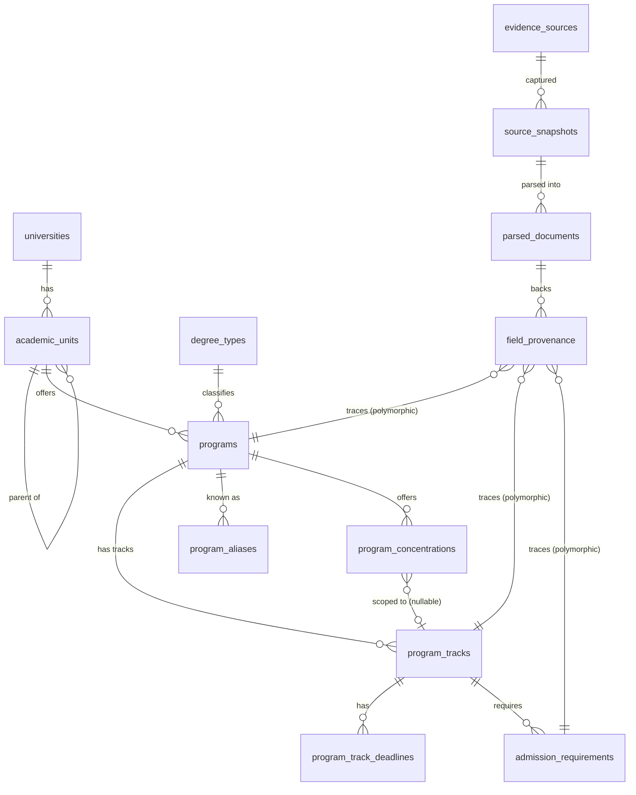

# Phase 2 Design: Program / Catalog Schema and Ingestion

**Status: design only. No implementation in this document or its
companion PR.** Per `FULL_HANDOFF.md` §21, this covers "program/catalog
schema" and "catalog adapter framework" as a design proposal, to be
reviewed before any scraping or migration work starts. Pilot institutions
are proposed at the end, not crawled.

## 0. Governing principle

> All raw information from a school's own site is preserved in full
> (original text and source URL). Standardized/normalized fields are
> nothing more than a structured reading of that raw information, and
> every field must be traceable back to where it came from.

This is stricter than "keep a URL somewhere." It means: for any field a
human or an LLM had to *interpret* (a deadline, a GPA minimum, a
prerequisite list, a funding note), the system stores the raw source text
next to the normalized value, not instead of it. Section 4 spells out
which fields get this treatment and why not all of them need to.

---

## 1. Scope of this phase

In scope: program discovery and canonicalization, degree/track/concentration
structure, admission-requirement text and light structuring, provenance
infrastructure, catalog adapters, a human review queue, duplicate
detection. Out of scope (later phases per the roadmap): funding data,
historical admission/funding outcomes, recommendation logic, image/screenshot
parsing.

---

## 2. Entity model



(`field_provenance`'s links to `programs` / `program_tracks` /
`admission_requirements` are polymorphic — one table, `entity_type` +
`entity_id` — the diagram draws three edges because Mermaid can't express
polymorphic FKs directly. See §5.)

### 2.1 Core hierarchy

```
academic_units
  id                    PK
  unitid                FK -> universities.unitid
  parent_unit_id        FK -> academic_units.id, nullable (self-referencing)
  unit_type             enum: college, school, department, division, institute, other
  name                  text                 -- as the institution names it
  official_url          text, nullable
  status                enum: active, discontinued, unverified
  <provenance columns — see §5>
```

Self-referencing rather than a fixed "college > department" two-level
model, because real org structures vary (some schools go Graduate School
→ College → Department → Program; others are flat). `unit_type` +
`parent_unit_id` can represent either without a schema change.

```
degree_types                              -- controlled but extensible lookup
  code            PK, e.g. "MS", "MA", "MEng", "MFA", "MPH", "MSW", "PhD"
  label           e.g. "Master of Science"
  level           enum: masters, doctoral, certificate, other
```

A lookup table, not an enum, because real degree-name vocabulary is wide
and grows over time (new professional master's names appear regularly);
adding a row shouldn't require a migration. `programs` still separately
stores the school's own raw string — see §4.

```
programs
  id                     PK (this is the stable "program_id" FULL_HANDOFF.md §5 asks for)
  academic_unit_id       FK -> academic_units.id
  degree_type_id         FK -> degree_types.code
  raw_degree_name        text        -- exactly as the school writes it, e.g. "M.S."
  canonical_name         text        -- e.g. "Computer Science"
  cip_code               text, nullable
  program_url            text, nullable
  stem_designated        bool, nullable
  status                 enum: active, discontinued, paused, unverified
  <provenance columns>

program_aliases                       -- same shape as university_aliases
  id, program_id (FK), alias, alias_type, source

program_tracks                        -- "the smallest meaningful unit" per §5
  id                     PK
  program_id             FK -> programs.id
  track_name             text                    -- raw, e.g. "Thesis Option"
  track_type             enum: thesis, non_thesis, project, coursework, unspecified
  modality               enum: in_person, online, hybrid
  campus_name            text, nullable          -- see §7.1
  credits_required        int, nullable
  expected_duration_months int, nullable
  min_gpa                 numeric, nullable        -- normalized to a 0–4 scale; see §4
  min_gpa_raw              text, nullable           -- e.g. "3.0/4.0" or "75/100" as written
  toefl_min, ielts_min     int, nullable
  gre_policy               enum: required, optional, waived, not_accepted, unspecified
  cohort_size              int, nullable
  international_share      numeric, nullable
  status                   enum: active, discontinued, paused, unverified
  <provenance columns>

program_track_deadlines               -- one track can have several intake terms
  id, program_track_id (FK)
  intake_term            text          -- "Fall 2027", "Spring 2027"
  application_deadline    date, nullable
  priority_funding_deadline date, nullable
  is_rolling              bool
  deadline_raw_text        text         -- "Priority: Dec 15; final: Feb 1, domestic only"
  <provenance columns>

program_concentrations
  id, program_id (FK), program_track_id (FK, nullable)
  name                  text
  description_raw       text
  <provenance columns>

admission_requirements
  id, program_track_id (FK, NOT NULL — see §7.4 for why track-level, not program-level)
  requirement_type       enum: gpa, test_score, prerequisite_course, recommendation_letters, document, other
  structured_value        jsonb, nullable    -- e.g. {"min": 3.0, "scale": 4.0}
  raw_text                 text              -- always present
  <provenance columns>
```

`<provenance columns>` on every table above means:
`last_seen_snapshot_id` (FK → `source_snapshots`), `verification_status`
(reusing `FULL_HANDOFF.md` §15's case-state vocabulary: `raw`, `parsed`,
`needs_review`, `user_confirmed`, `document_verified`,
`rejected_as_invalid`), `last_verified_at`. This is the *entity-level*
provenance; §5 covers *field-level* provenance for the fields that need
finer granularity than "this whole row came from snapshot X."

---

## 3. Relationships, in one sentence each

- One **university** has many **academic_units**, which can nest (college
  → department → …).
- One **academic_unit** offers many **programs**; a **program** belongs to
  exactly one unit and one **degree_type**.
- One **program** has one or more **program_tracks** — this is where
  thesis/non-thesis, modality, and campus variation live (§7).
- One **program_track** has zero or more **program_track_deadlines** (one
  per intake term) and one or more **admission_requirements** rows.
- **program_concentrations** hang off a **program**, optionally scoped to
  one **track** if a school ties a concentration to a specific modality or
  admission path.
- Every content-bearing row links back to a **source_snapshot** at the row
  level, and the fields that were genuinely *interpreted* (not just
  copied) also get a **field_provenance** row (§5).

---

## 4. What gets standardized vs what stays raw

| Category | Standardize? | Raw text kept? |
|---|---|---|
| Program/track/unit names | Store both: `canonical_name` (cleaned for search/display) and the literal school string | Yes, always (the literal string *is* the raw form here — no separate raw column needed) |
| Degree type | `degree_type_id` (controlled lookup) | Yes — `raw_degree_name` |
| CIP code | Standardized (federal taxonomy) | The catalog text it was inferred from, via field_provenance if not explicitly labeled by the school |
| Deadlines | Parsed to `date` where unambiguous | Yes, always — `deadline_raw_text`. Ambiguous cases (e.g. "rolling until filled," "priority Dec 1, otherwise space-available") are marked `is_rolling` / left null with the raw text as the source of truth, never guessed into a fake date |
| GPA / test-score minimums | Parsed to numeric, normalized to a stated scale | Yes, always — grading scales vary (0–4, 0–100, letter) and normalizing without keeping the original invites exactly the kind of silent error `FULL_HANDOFF.md` §9 warns about for GPA conversion |
| Prerequisites, recommendation requirements, general admission narrative | Light structuring only (`requirement_type` tag) | Yes, always — this text is usually too school-specific to fully normalize, and forcing it into structured fields would lose information |
| Program URL, official pages | n/a | The URL itself is the artifact; snapshot stores the fetched content |

Rule of thumb: **if going from raw text to a structured value required a
judgment call — by a human or an LLM — the raw text is mandatory, not
optional.** If the structured value *is* the raw value (e.g. a URL, or a
program name copied verbatim), a second raw copy would be redundant and
isn't required.

---

## 5. Provenance infrastructure

```
evidence_sources
  id, unitid (FK, nullable — some sources aren't institution-specific, e.g. a ranking publisher)
  source_type     enum: academic_catalog, department_page, graduate_school_page,
                        international_office, institutional_report, ranking_publisher
  base_url

source_snapshots
  id, evidence_source_id (FK)
  url
  retrieved_at
  http_status
  content_hash          -- for cheap change detection (§6)
  raw_content            -- full fetched HTML/text/PDF-extracted-text
  fetch_method            -- which adapter fetched it

parsed_documents
  id, source_snapshot_id (FK)
  adapter_name, adapter_version
  parsed_at
  extraction_confidence
  raw_extraction         jsonb    -- the adapter's structured output, pre-review

field_provenance                  -- the field-level ledger described in §0
  id
  entity_type            enum: program, program_track, academic_unit, admission_requirement, program_track_deadline
  entity_id
  field_name              text     -- e.g. "min_gpa", "application_deadline"
  source_snapshot_id       FK
  parsed_document_id       FK, nullable
  raw_text
  normalized_value          text   -- stored as text; the entity's real column holds the typed value
  confidence
  verification_status       -- same vocabulary as entity-level status
  extracted_by               -- adapter name, or "human:<user_id>" for manual entry/correction
  extracted_at

data_review_tasks
  id, entity_type, entity_id, field_name (nullable — can flag a whole row)
  reason                  enum: low_confidence, first_seen, conflicts_with_existing, adapter_fallback_used, reported_by_user
  status                   enum: open, in_review, resolved, dismissed
  assigned_to, resolved_at

data_conflicts
  id, entity_type, entity_id, field_name
  current_value, current_verification_status
  proposed_value, proposed_source_snapshot_id
  status                  enum: open, resolved_kept_current, resolved_took_proposed
```

`field_provenance` is applied selectively, not to every field of every
table — see §4's rule of thumb. Applying it universally (true EAV) would
be more "complete" but adds real query complexity for fields that are
never actually ambiguous (a URL is a URL). This is a judgment call worth
you weighing in on before implementation: the alternative is a simpler
per-row `raw_snapshot_id` + a few `_raw_text` sibling columns on the
tables that need them (as sketched in §2), skipping the separate
`field_provenance` table entirely. That's less powerful (can't independently
track confidence/verification per field) but meaningfully simpler to
build and query. I'd lean toward starting with the simpler sibling-column
version and only introducing full `field_provenance` if the pilot shows
we need per-field confidence tracking that sibling columns can't give us
— but this is exactly the kind of call worth making explicitly rather
than defaulting silently.

---

## 6. Data update strategy

1. **Re-crawl cadence**: periodic re-fetch per source (e.g. quarterly for
   `active`/verified programs, more frequently as application deadlines
   approach for tracked programs). Compare `content_hash` against the
   previous snapshot for the same URL — if unchanged, skip re-parsing
   entirely (cheap).
2. **Change detection**: if the hash differs, queue a re-parse
   (`parsed_documents`). If the newly parsed value differs from the
   currently stored value:
   - If the current value's `verification_status` is `document_verified`
     or `user_confirmed`, do **not** silently overwrite it — write a
     `data_conflicts` row and raise a `data_review_task`. This mirrors the
     non-regression rule already implemented in the HD importer (a newer
     IPEDS year can't silently overwrite a more-recent one; the same
     logic applies here to trust level rather than recency).
   - If the current value is only `parsed`/`raw`/`needs_review`, the new
     extraction can replace it automatically (nothing trusted is being
     clobbered).
3. **Status lifecycle**: if a program's page 404s or disappears from a
   catalog listing, don't immediately mark it `discontinued` — transient
   site issues happen. Mark `unverified` after one failed re-check,
   `discontinued` only after N consecutive failures (N TBD during pilot,
   probably 2–3 cycles), and always surface the transition as a
   `data_review_task` rather than a silent auto-update.

---

## 7. Handling variants

### 7.1 Multiple campuses
IPEDS already assigns separate `UNITID`s to most distinguishable branch
campuses, so this is usually handled for free by the existing
`universities` table. For the residual case where one `UNITID` genuinely
offers a program at more than one physical site, `program_tracks.campus_name`
is a nullable field rather than a new top-level entity — avoids
speculative modeling until the pilot shows it's actually needed.

### 7.2 Modality (in-person / online / hybrid)
Modeled on `program_tracks`, not `programs` — because modality often comes
with genuinely different admission requirements and deadlines (a common
real pattern: "MS CS – Online" has different test-score policy than the
on-campus version). Treating it as a track dimension means it falls out of
the existing `program_tracks` → `admission_requirements` /
`program_track_deadlines` structure with no special-casing.

### 7.3 Multiple intake terms / deadlines
Handled by `program_track_deadlines` being a child table (one row per
intake term) rather than flattening `fall_deadline`/`spring_deadline`
columns onto `program_tracks` — supports however many terms a school
actually offers without a schema change.

### 7.4 Different degree types under "the same" program
E.g. a department offering both an MS and a PhD in Computer Science. These
are two separate `programs` rows (different `degree_type_id`), sharing the
same `academic_unit_id`. This isn't special-cased — it falls directly out
of the identity key `FULL_HANDOFF.md` §5 already specifies: *university +
college + department + degree + program + track*. Degree type is part of
what makes two programs different, not a variant of one program.

This is also why `admission_requirements` links to `program_track_id`
rather than `program_id`: requirements are frequently degree- and
track-specific (an MS and a PhD in the same department rarely share
identical admission criteria), so anchoring at the track level is more
correct even though it means near-duplicate requirement rows for programs
whose tracks genuinely do share identical requirements. That duplication
is an accepted, explicit tradeoff — the alternative (requirements at the
program level with per-track overrides) adds resolution-order complexity
for a case that may not be common enough to justify it. Worth revisiting
after the pilot shows how often tracks actually share requirements
verbatim.

### 7.5 Concentrations
`program_concentrations` references `program_id` (concentrations are
usually presented as a menu within one program) with an optional
`program_track_id` for the less common case where a school ties
concentration availability to a specific track/modality.

---

## 8. Catalog adapter architecture

Interface, expanding `FULL_HANDOFF.md` §5's sketch:

```python
class CatalogAdapter(Protocol):
    def detect(self, url: str, html: str) -> bool:
        """Cheap, order-sensitive check: does this adapter recognize the page?"""

    def extract_programs(self, html: str) -> list[RawProgramCandidate]: ...
    def extract_degrees(self, html: str) -> list[RawDegreeCandidate]: ...
    def extract_requirements(self, html: str) -> list[RawRequirementCandidate]: ...
```

Concrete adapters, tried in order via a registry (first `detect()` match
wins): `AcalogAdapter`, `CourseLeafAdapter`, `ModernCampusAdapter`,
`PdfCatalogAdapter`, `GenericHtmlAdapter`, `LLMFallbackAdapter` (always
matches — the catch-all).

Pipeline:

```
fetch page
  → write source_snapshot (raw content + content_hash)
  → adapter registry .detect() in priority order
  → deterministic parse (adapter-specific) → RawProgramCandidate / etc.
  → validation (schema shape, sanity bounds — "GPA must be 0–4 or 0–100",
    "deadline must be a plausible date", "credits > 0")
  → if parse failed or confidence is low: LLMFallbackAdapter on cleaned text
  → write parsed_documents (raw_extraction, confidence)
  → write/update programs/tracks/etc. at verification_status = "parsed"
    (deterministic adapters) or "needs_review" (LLM fallback, always)
  → data_review_task created for anything below a confidence threshold
    or produced by the LLM fallback
```

Detection is by URL pattern first (e.g. `*.courseleaf.com`,
`/acalog/` path segments — cheap, no page fetch needed to guess) and HTML
fingerprint second (recognizable markup/meta tags each platform emits) —
this needs to be verified against real examples in the pilot, not assumed;
adapter detection heuristics are exactly the kind of thing that looks
right in isolation and breaks on a real page.

**Cost control**: the LLM fallback is the expensive path and should be the
minority case if deterministic adapters are doing their job — this is
worth tracking as a metric (`% of pages parsed by LLMFallbackAdapter`)
from the very first pilot run, not added later.

---

## 9. Human review mechanism

- Every automated write defaults to `verification_status = parsed` (deterministic
  adapter) or `needs_review` (LLM fallback) — never `document_verified`.
  Nothing is presented to end users as fully trusted until a human (or a
  sufficiently strong deterministic signal, see below) confirms it.
- `data_review_tasks` is the queue. A reviewer sees: the raw text, the
  proposed normalized value, the source URL/snapshot, and (for conflicts)
  the currently stored value side by side.
- Reviewer actions: **confirm** (→ `user_confirmed`), **edit** (correct the
  normalized value; raw text is never edited, only annotated as
  superseded), **reject** (→ `rejected_as_invalid`, field reverts to null
  pending re-extraction).
- One calibrated exception to "always needs a human": high-confidence,
  identity-like fields from a *deterministic* adapter on a *known-reliable*
  catalog platform (e.g. a program name lifted from a CourseLeaf catalog's
  structured listing) can be auto-promoted past `needs_review` — but this
  should be an explicit, narrow allowlist decided after the pilot shows
  which fields are actually reliable, not a default.
- This mirrors `FULL_HANDOFF.md` §15's evidence levels and §17's
  requirement to show "evidence confidence" separately from "model
  confidence" on the eventual recommendation card — the schema here is
  what makes that distinction possible downstream.

---

## 10. Duplicate program detection

1. **Before creating a new `programs` row**, normalize the candidate name
   (case, whitespace, punctuation) and check `program_aliases` +
   `programs.canonical_name` for a close match within the same
   `academic_unit_id` + `degree_type_id`. Use Postgres `pg_trgm` trigram
   similarity for fuzzy matching ("M.S. Computer Science" vs "MS in
   Computer Science").
2. **CIP code as a secondary signal**: matching CIP code + unit + degree
   type is strong duplicate evidence even when the name text differs more
   than the trigram threshold catches.
3. **Never auto-merge.** A likely-duplicate match creates a
   `data_review_task` (reason: a new `possible_duplicate` value would be
   added to the reason enum) with both candidates shown side by side —
   same "system suggests, human confirms" pattern `FULL_HANDOFF.md` §14
   specifies for community-data case bundles.
4. Once merged, the losing name becomes a `program_aliases` row rather
   than being discarded — so future re-crawls that surface the same
   variant text match on the first pass instead of re-triggering a
   duplicate review.

---

## 11. Proposed pilot (design validation only — not a crawl authorization)

`FULL_HANDOFF.md` §2 names Louisiana State University, University of
Alaska Fairbanks, and University of Mississippi as example
"overlooked institutions" — all three are already in the institution
index, and their real Carnegie classifications (via the API built in this
session) give a grounded, non-arbitrary way to pick a diverse pilot set
rather than guessing:

| Candidate | Why | Confirmed from real data |
|---|---|---|
| A large R1 public | Stress-tests a big, likely well-structured catalog (probably CourseLeaf/Acalog-class) | University of Mississippi and UT Austin are both "Doctoral Universities: Highest Research Activity" in the current index — either works; UT Austin was already spot-checked earlier this session |
| A "higher" (not "highest") research public | Tests a still-large but slightly different catalog system, and directly represents the handoff's "overlooked institution" thesis | University of Alaska Fairbanks — "Doctoral Universities: Higher Research Activity" |
| A private nonprofit, master's-focused (not doctoral) | Different Carnegie tier (`C21BASIC` 18/19/20 — "Master's Colleges & Universities"), likely a smaller/different catalog vendor | e.g. Alabama A & M University's tier ("Larger Programs") — need a *private* nonprofit example; can pull one from `GET /universities?sector=private_nonprofit&masters_granting=true` when scoping starts |
| A PDF-only catalog school | Exercises `PdfCatalogAdapter` specifically | Not yet identified — this needs to be found by actually looking, not guessed; smaller regional or specialized institutions are the likely candidates, but asserting a specific one without checking would violate the "never invent facts" rule this whole project runs on |
| A different catalog CMS (Acalog vs. CourseLeaf vs. Modern Campus vs. custom) | Exercises adapter detection/registry logic for real | Same — needs actual inspection of a handful of candidate institutions' catalog URLs before naming names |

Recommended next step, still within "design/validation, not full
implementation": manually visit 5-8 candidate institutions' catalog pages
(mixing the confirmed Carnegie tiers above with a couple of unknowns for
the PDF/CMS-diversity slots), record which adapter each would need, and
*then* pick the final pilot 3–5 with actual evidence instead of
assumptions — consistent with how the Carnegie classification and
master's-granting filter in this project were built against real
downloaded files rather than assumed field names.

---

## 12. Open decisions worth your input before implementation

1. **Field-level provenance**: full `field_provenance` EAV table (§5) vs.
   simpler per-row `raw_*` sibling columns. Recommendation: start simple,
   upgrade if the pilot shows a real need.
2. **`admission_requirements` at track level** (§7.4): accepts some
   duplication for tracks with identical requirements. Alternative:
   program-level with track overrides — more normalized, more complex.
3. **Auto-promotion allowlist** (§9): whether *any* automated extraction
   should ever skip human review, even for high-confidence deterministic
   adapters on reliable platforms.
4. **PDF catalog handling depth**: OCR quality and PDF structure vary
   wildly; worth deciding up front how much effort `PdfCatalogAdapter` is
   expected to handle before falling back to `LLMFallbackAdapter` or a
   manual-entry path.
